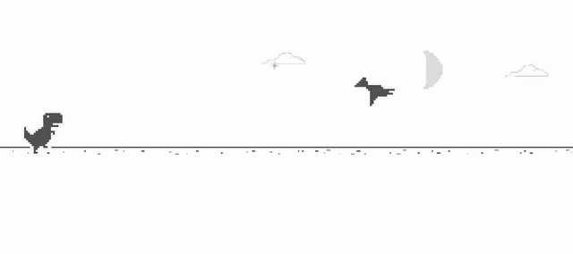

# laya-dino

The **real Chrome dinosaur game**, played in a real browser by a *one-decision
model*, [laya](https://github.com/NandhaKishorM/laya), an open-source
non-autoregressive "System 1" decision engine.



*The real Chromium t-rex runner, in a real browser, driven by a 322M-parameter
encoder answering one yes/no question ~30 times a second. Full clip:
[docs/laya-dino-best.mp4](docs/laya-dino-best.mp4).*

**Writeup:** [I Taught a One-Decision Model to Play Chrome Dino, and It Kept Telling Me I Was Wrong](https://bookofdaniel.in/posts/2026-09-23-i-taught-a-one-decision-model-to-play-chrome-dino/).
The four failures on the way to that clip, and what they say about the
one-decision pitch.

**Background:** [Jev: The AI That Refuses to Talk to You](https://bookofdaniel.in/posts/2026-09-22-jev-the-ai-that-refuses-to-talk-to-you/).
On TypeSafe's launch, its benchmark, and why Laya showing up with open weights
made the claims checkable. This repo is that post's closing instruction ("go
run it on your own data") actually carried out.

---

No text generation. The game state is written as one short line, the model is
asked a single binary question, and answers with a calibrated probability:

```
obstacle=cactus_small dist=118 speed=13.0 w=51 h=35 alt=0 airborne=0 vy=0.0

   "Should the dino jump right now to clear the next obstacle?"  ->  0.997
```

That is the entire control loop. ~30ms per decision, ~2,800 decisions per run.

**Result: median 976 over 28 runs, best 3,209**, reaching maximum game speed in
17 of 28 runs, on the actual Chromium t-rex runner driven through a browser at
61fps. Scores vary enormously (81 to 3209) between randomly generated levels.


---

## Results

### Real Chrome dino

**28 runs**, 180s cap, decision threshold 0.995:

```
median 976 | mean 1206 | IQR 428 - 2086 | range 81 - 3209
reached max speed (13.0):     17/28
survived the full time limit:  3/28
decision latency: p50 23-30ms, p90 24-37ms
```

The spread matters as much as the median. Identical model and settings produce
anything from 81 to 3209 depending on which level the game randomly generates
,  a 40x range. **Any single run tells you almost nothing**, which is worth
remembering when you see a demo video of an AI playing a game.

Videos (`results/`):
- `chrome_best.mp4`, a 2178 run, reaching max speed and night mode
- `chrome_typical.mp4`, an 896 run, close to the median
- `video_clips/`, one self-describing file per run

Typical human scores sit around 500 to 1500, so the model is roughly human-level
at the median and better than most humans at its best, but it does not
reliably beat the game.

> An earlier version of this README claimed "median 2552" from a 5-run sample,
> then "median 1062" from 20. Both were premature. The lesson is in the numbers:
> with this much variance, small samples produce whatever answer you want.

### Model quality

| | accuracy | recall | precision | ECE |
|---|---|---|---|---|
| zero-shot laya | 0.468 | 0.463 |, | 0.191 |
| fine-tuned head | 0.964 | 0.963 | 0.967 | 0.0217 |
| + temperature (1.568) | 0.964 |, |, | **0.0133** |

Zero-shot is **below chance** on a balanced task, matching laya's own docs:
base checkpoints score near chance on typed decisions. laya is a base to
specialise, not a zero-shot reasoner.

---

## Three things this project actually found

### 1. The frame budget is not the decision budget

Measured on an M1 Pro (16GB), one binary question, p50:

| checkpoint | device | short state | medium | long |
|---|---|---|---|---|
| ModernBERT-large 421M | CPU | 119ms | 215ms | 361ms |
| ModernBERT-large 421M | MPS | 43.6ms | 90.6ms | 158ms |
| mmBERT-base 322M | CPU | 48.9ms | 105ms | 332ms |
| **mmBERT-base 322M** | **MPS** | **29.6ms** | 50.3ms | 148ms |

A frame at 60fps is 16.7ms, so 29.6ms looks fatal. It isn't. **The dino does
not decide every frame, it decides once per obstacle, inside the window where
a jump still clears.** Over 3,822 obstacles:

```
worst case:   12 frames = 200ms
p01:          16 frames = 267ms
median:       22 frames = 367ms
```

200ms of slack against a 30ms decision. Polling every 2 frames (33ms) cannot
miss a window.

That measurement killed a planned optimisation pass: ONNX export, int8
quantisation, and a Rust host binary to chase 16.7ms. None of it was needed.
The Rust prototype that produced the measurement is kept in `spike/rust-sim/`
because it earned its place by making itself unnecessary.

### 2. 96.8% accuracy died on the first cactus

The first working model scored 96.8% on held-out frames and died at the first
obstacle in all 8 test runs.

It was right about the decision and wrong about the *operating point*. At
`dist=169`, 30 frames before a jump was survivable, it said **0.927** and
jumped, landing on the cactus. Those errors cluster at the window boundary,
where a false positive is fatal and a false negative costs nothing (the window
stays open another 10 to 22 frames and we poll every 2).

Moving the threshold from 0.5 to 0.995 is what makes it play:

```
threshold 0.97   ->  1/8 survived
threshold 0.99   ->  3/8
threshold 0.995  ->  4/8      <- operating point
threshold 0.998  ->  0/8      (too strict; starts missing windows)
```

**Calibration is what makes that dial meaningful.** With ECE 0.013 a stated
0.995 means something. On an uncalibrated model, which is what laya ships, per
its own runtime warning, it would be noise.

### 3. The reality gap was in our simulation, not the bridge

Wiring the model into the real browser worked mechanically on the first try.
It then scored 248 where the sim scored 1987.

The cause was our own physics. Chromium's `updateJump` calls `endJump()` once
the dino passes `MAX_JUMP_HEIGHT`, clamping velocity to `DROP_VELOCITY` and
truncating the ascent. We had modelled a free parabola:

| | peak height | hang time |
|---|---|---|
| free parabola (wrong) | 99px | 36 frames |
| Chromium (correct) | 87px | 33 frames |

Small numbers, decisive effect: the sim believed a 51px cactus cluster was
clearable from 201px away. Chrome disagreed. After implementing the cap the sim
agreed with the browser, that window opens at ~190px, not ~220px, and the
score went from 248 to 3209.

This is a bug no accuracy metric can surface. The model faithfully reported
what it had been taught; what it had been taught was wrong.

---

## Is this just a three-line if-statement?

This was the obvious objection from the start, so it got tested properly.

The baseline is `if jumpable and dist < k*speed + c*width: jump`, with (k, c)
swept over a 2D grid and tuned to the best configuration found. Then both
controllers were run on three disjoint seed ranges, one the baseline was
tuned on, two it never saw. The model trained on seeds 0 to 199 and has seen none
of them.

| seed range | laya | tuned one-liner |
|---|---|---|
| 50000 to 07 *(baseline tuned here)* | 4/8 | **6/8** |
| 60000 to 07 *(held out)* | **8/8** | 3/8 |
| 70000 to 07 *(held out)* | **6/8** | 2/8 |
| **total** | **18/24** | 11/24 |

The one-liner wins only on the seeds it was fitted to. Off them it collapses,
because whether a fixed jump arc clears a 75px cactus cluster depends on arc,
width and speed together, not a linear threshold on distance. Tuning `k` to
the levels in front of you is fitting the test set.

So the honest claim is not "a big model beats a one-liner at dino". It is:

> A general-purpose decision model, fine-tuned on free labels, generalises
> across levels better than a hand-tuned rule, and holds up in a real-time
> loop at about 30ms a decision, about 2,800 decisions a run, against a game
> that does not wait.

The genuinely correct hand-written controller is the oracle, which brute-forces
the arc every frame. That is not a three-line if.

## How it works

### Faithful simulation (`laya_dino/game.py`)

Ported from the Chromium t-rex runner using its real constants *and* its real
behaviours: speed-dependent jump velocity (`-10 - speed/10`), the jump-height
cap, per-frame `Math.round`, cactus clusters (size 1 to 3), Chromium's gap formula,
and the actual per-sprite collision boxes (6 for the dino, 3 per cactus).

Two properties are load-bearing:

- **Deterministic**, same seed + same actions → identical replay. This is what
  makes the oracle's labels exact.
- **No wall-clock coupling**, the game advances only when `tick()` is called,
  so a 30ms decision cannot corrupt the physics during data generation.

### The oracle (`laya_dino/oracle.py`)

This is why dino is a good testbed: ground truth is free and exact. No human
annotators, no teacher LLM grading a student. To label a frame we fork the
deterministic sim, play out both branches, and see which survives.

Every label is a fact, a stronger footing than published one-decision
benchmarks, which largely measure agreement with other AI systems.

### Training data (`scripts/gen_dataset.py`)

Three sampling problems, each of which silently wrecked a run before being fixed:

- **Class imbalance.** Jumps are 2 to 4% of frames. Train on the raw stream and the
  model learns to always say "no", 97% accurate, dead in ten seconds.
- **Off-trajectory positives.** The oracle jumps on the *first* frame of a
  window, so following it yields one positive per obstacle. But the window is
  12 to 22 frames wide and jumping is correct throughout. At inference the model
  routinely finds itself several frames into a window, states an
  on-trajectory dataset never contains. We fork at each window and record the
  whole interior.
- **Distance coverage.** Balancing only on (obstacle, label) thinned out
  long-range negatives until "dist=326 → no" was out of distribution. The model
  produced confident nonsense there and jumped at 326px. Stratifying by
  distance band as well fixed it.

1.3M rows, generated in ~2 minutes.

### Fine-tuning (`scripts/train.py`)

The 322M encoder is **frozen**; only the decision head trains (15.0M params,
4.7%). The encoder already knows how to read `dist=118`; the threshold rule
lives in the head. Runs in ~70 minutes on an M1 Pro rather than the 4 to 5
GPU-hours of a full RLCD run.

A single temperature is then fitted on a held-out calibration split, clamped to
laya's own `[0.5, 5]` range. (Unclamped, LBFGS ran away to 137 on a small split
and flattened every probability.)

### The browser bridge (`scripts/play_chrome.py`)

`chrome://dino` cannot be automated, Chrome blocks DevTools control of
`chrome://` URLs, so we serve the Chromium t-rex runner source locally. Same
game code, same constants, just reachable. State comes from the game's own
globals rather than from pixels:

```js
Runner.instance_.currentSpeed
Runner.instance_.horizon.obstacles[0].xPos
Runner.instance_.tRex.jumping
```

One `evaluate()` round-trip costs 0.4ms. Both the sim and the browser route
through `jump_prob_from_obs`, so they are guaranteed to build byte-identical
prompts, divergence there would be invisible and would look like a transfer
failure.

---

## Running it

```bash
uv venv --python 3.12 .venv
VIRTUAL_ENV=.venv uv pip install 'laya>=0.3.3' torch numpy pytest pillow playwright
.venv/bin/playwright install chromium
git clone --depth 1 https://github.com/wayou/t-rex-runner third_party/t-rex-runner

PYTHONPATH=. .venv/bin/python scripts/gen_dataset.py                    # ~2 min
PYTHONPATH=. .venv/bin/python scripts/train.py --encoding numeric --balance \
    --limit-train 100000 --epochs 3                                     # ~70 min
PYTHONPATH=. .venv/bin/python scripts/play.py --threshold 0.995         # sim
PYTHONPATH=.:scripts .venv/bin/python scripts/play_chrome.py \
    --games 5 --threshold 0.995                                         # real Chrome

PYTHONPATH=. .venv/bin/python -m pytest tests/ -q                       # 40 tests
```

Python 3.12 (torch has no 3.14 wheels). `ffmpeg` for video.

---

## Repo layout

```
laya_dino/game.py       faithful Chromium sim
laya_dino/oracle.py     brute-force perfect player + label generator
laya_dino/state.py      frame -> text encoding (numeric | bucketed)
scripts/gen_dataset.py  oracle rollouts -> labelled jsonl
scripts/train.py        head-only fine-tune + temperature calibration
scripts/play.py         oracle vs threshold vs laya, in the sim
scripts/play_chrome.py  the real game, in a real browser
scripts/render.py       sim replay -> mp4 with P(jump) overlay
spike/rust-sim/         Rust prototype; source of the jump-window measurement
spike/bench.py          the latency benchmark
RUN_LOG.md              chronological log of every stage, including failures
```

## Known gaps

- **3/5 Chrome runs still crash.** The model is good, not perfect.
- **The bucketed-encoding ablation was not run.** It would answer "how much is
  the model vs. how much did the prompt pre-solve", the code supports it
  (`--encoding bucketed`), it just hasn't been trained.
- The sim's RNG is not Chrome's `Math.random()`, so levels are statistically
  similar, not identical.
- Collision uses Chromium's real boxes, but ducking is not modelled (the model
  jumps high pterodactyls or runs under them; it never ducks).

## Credits

- [laya](https://github.com/NandhaKishorM/laya) by Convai Innovations (Apache 2.0)
- [t-rex-runner](https://github.com/wayou/t-rex-runner), extracted Chromium
  game source (BSD 3-Clause). Vendored under `third_party/`.

## License

Apache 2.0
